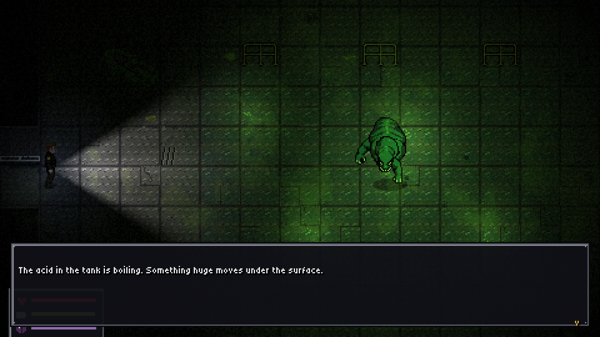
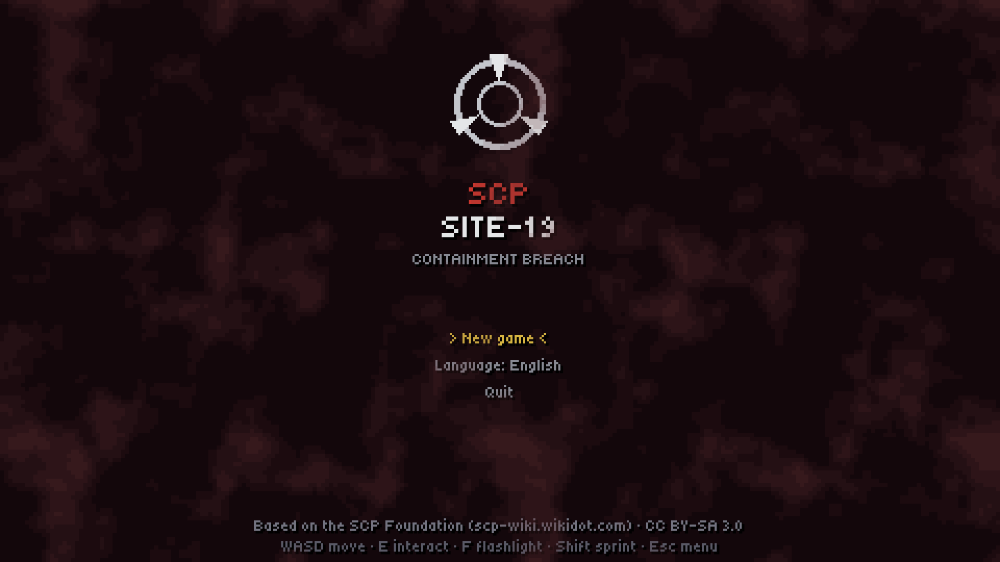
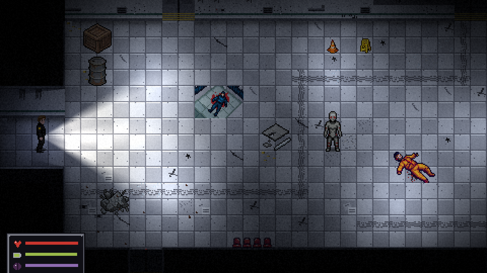
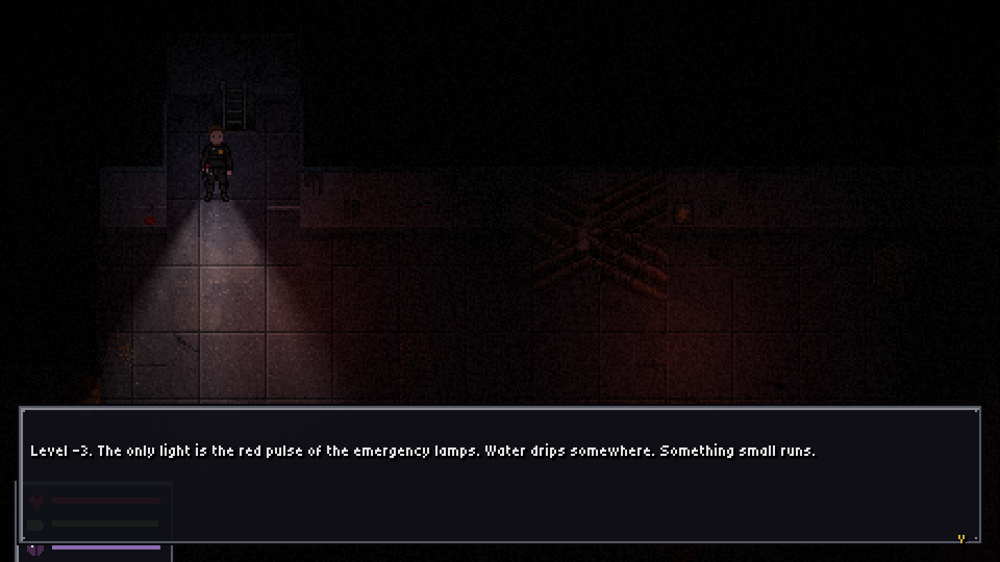
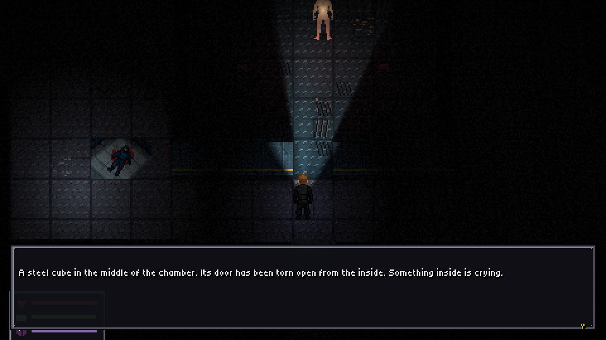
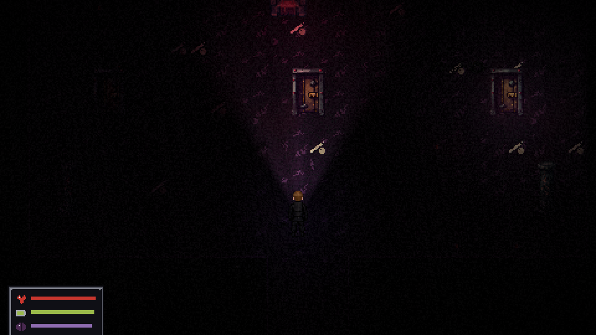
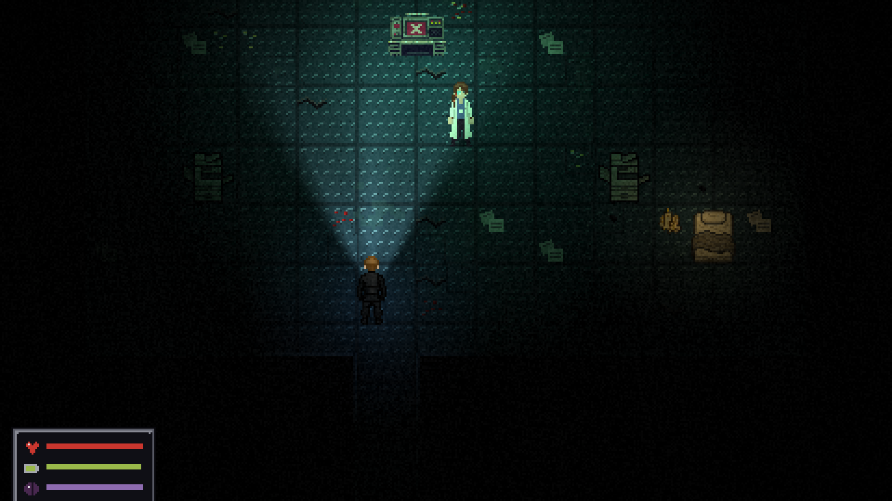
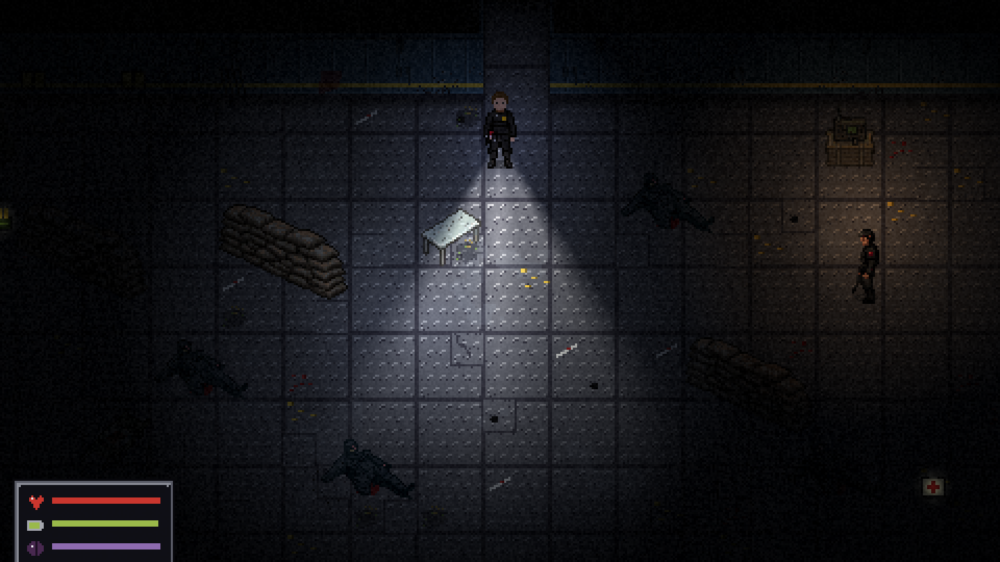
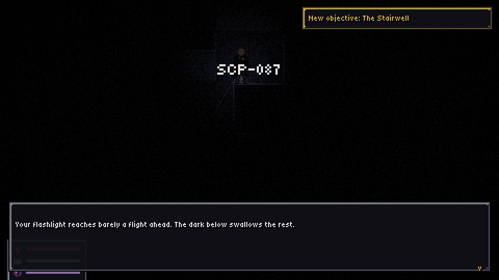

# SCP: Site-19

**A slow-burn pixel-art horror game set inside a breached SCP Foundation facility.**
Single player · English / Español · Linux & Windows · Free and open (CC BY-SA 3.0)



> *03:12. Containment breach at Site-19. Every cell on every level opened at once.*
> *You are Agent Vega, ex-Nine-Tailed Fox. You are going down alone. Your sister works down there.*

Go down through 65 hand-built rooms, from the entrance lift to Level -5. Recontain what got loose,
find out who opened the cells, and decide what happens to the people still alive down there.

## What it is like

- **Dread, not jump-scares.** Your flashlight casts real shadows. Fog, dust, steam and flickering
  fluorescent lights. Sounds that are close, far, soft or loud: drips, vents, distant screams,
  something breathing in the dark.
- **SCPs that behave like their articles.** SCP-173 moves only when you blink. SCP-096 must never
  see your face. SCP-939 is blind and hunts by sound, so walk and don't run. SCP-106 walks through walls
  and hates the light. SCP-049 wants to cure you. SCP-682 cannot be killed.
- **Every anomaly leaves traces:** corrosion trails where 106 walked, blood smears where 173 was
  dragged, acid burns, claw marks, red residue in 939 territory.
- **A big facility made of many small places:** offices, D-Block cells, SCP-914, maintenance tunnels,
  sewers, the SCP-087 stairwell, the medical wing, Heavy Containment, a pocket dimension, the SCP-079 core.
- **People worth saving.** A frightened D-class kid, a janitor who feeds the rats, a dying Nine-Tailed Fox
  corporal, a doctor with a plague mask. Some follow you. Some don't make it.
- **Side quests, 38 readable documents, 3 endings.** Your choices, and who survived, change the epilogue.
- Rats, cockroaches, spiders, moths and flies everywhere.

| | |
|---|---|
|  |  |
|  |  |
|  |  |
|  |  |

## Play

**Download** the latest build from [Releases](https://github.com/bramenn/scp-game/releases)
(Linux `.x86_64` or Windows `.exe`) and run it. There is nothing to install.

**Or run from source** with [Godot 4.7](https://godotengine.org/download):

```sh
git clone https://github.com/bramenn/scp-game.git
cd scp-game
godot --path .
```

### Controls

| Action | Keys |
|---|---|
| Move | WASD / arrow keys (tap to turn) |
| Sprint | Shift (loud!) |
| Interact / talk / advance | E, Enter, Space |
| Flashlight | F |
| Menu (objectives, inventory, documents, map, options) | Esc, Tab, I |

The language can be switched between **English and Spanish** from the title screen or in Options.

## Development

Everything is data-driven and regenerated by scripts:

| Path | What |
|---|---|
| `tools/maps/*.py` → `data/maps/*.json` | Maps, written in a small Python DSL (`tools/mapdsl.py`). Build: `python3 tools/build_maps.py` |
| `tools/story/*.py` → `data/*.json` | Story: events, dialogue, quests, items, documents (EN+ES). Build: `python3 tools/build_story.py` |
| `tools/gen_art.py`, `tools/gen_audio.py` | Procedural tiles, UI, sounds and music (needs Pillow, numpy, scipy) |
| `tools/pixellab.py` | Sprite generation via the PixelLab API (reads `PIXELLAB_TOKEN` from the environment) |
| `tests/run_all.sh` | A bot plays the whole game through simulated input, route by route |

The design document and progress log are in [`docs/DESIGN.md`](docs/DESIGN.md).

## License and credits

Based on the [SCP Foundation](https://scp-wiki.wikidot.com), licensed under
[CC BY-SA 3.0](https://creativecommons.org/licenses/by-sa/3.0/). This game is released under the same license.
Authors of every SCP article used are listed in [CREDITS.md](CREDITS.md).
